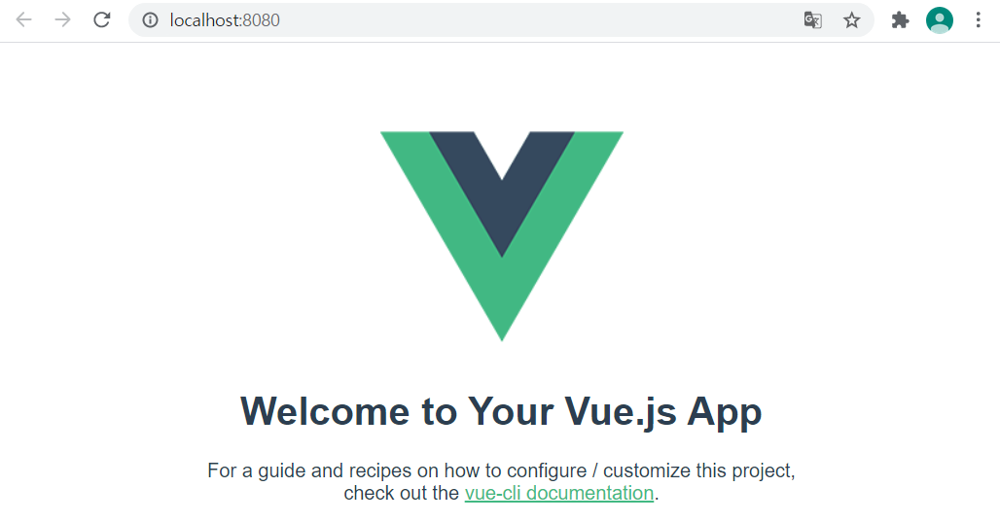
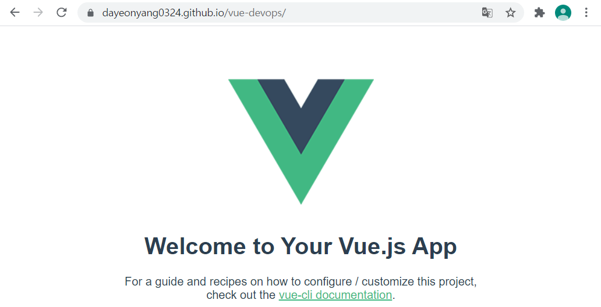
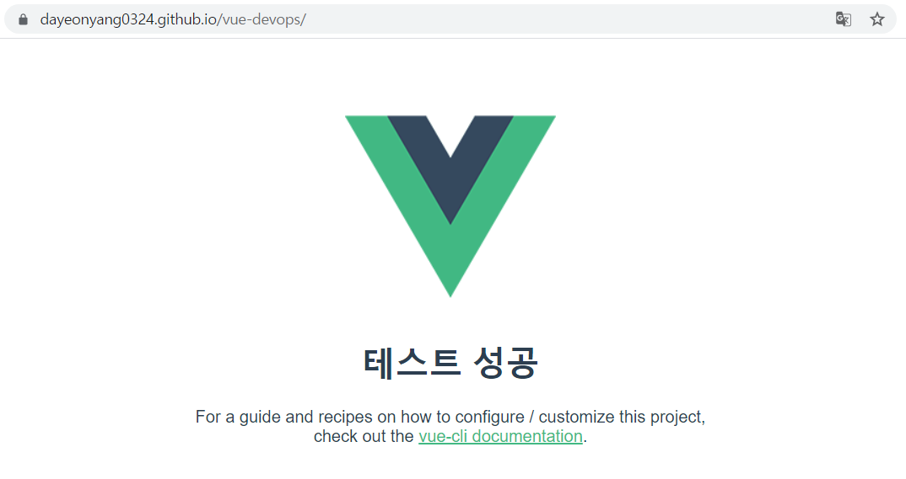

# vue-devops

## Project setup
```
yarn install
```

### Compiles and hot-reloads for development
```
yarn serve
```

### Compiles and minifies for production
```
yarn build
```

### Run your unit tests
```
yarn test:unit
```

### Lints and fixes files
```
yarn lint
```

### Customize configuration
See [Configuration Reference](https://cli.vuejs.org/config/).

<hr>

## Vue CLI 프로젝트 기반 DevOps 개발환경

### 1. Vue 프로젝트 생성 및 로컬 실행 확인

- Vue CLI 설치를 위한 Yarn 최신 버전 설치 (vs code에서 실행함) & 버전 확인

- ```bash
  > yarn global add @vue/cli
  > vue -V
  ```

- github와 연동 되었는지 확인(`git config -I`)

- 연동 되어 있지 않다면 정보 설정

  ```bash
  > git config --global user.name '이름'
  > git config --global user.email 이메일
  ```

- vue 프로젝트 생성

  ```bash
  > vue create vue-devops
  > 선택 항목(순서대로) : Manual select features, Unit Testing 추가(space선택, enter넘어감), 3.x, ESLint + Prettier, Lint on save, Jest, In dedicated config files, N
  ```

- 프로젝트 실행 확인

  ```bash
  > cd vue-devops
  > yarn serve # 웹 확인
  ```

  



<br>

### 2. GitHub에 코드 Push 및 Pages에 수동 배포

- github에 rep 만든 후 push 하기

- 배포하기 위한 라이브러리 추가

  ```bash
  > yarn add gh-pages -D
  ```

- `package.json`에서 다음 내용 추가

  ```json
  "private": ...,
  "homepage": "https://{gitID}.github.io/vue-devops",
  "scripts": {
      ...,
      "build":...,
      "predeploy": "vue-cli-service build",
      "deploy": "gh-pages -d dist",
      "clean": "gh-pages-clean",
      ...
  }
  ```

- 배포용 publicPath 설정 : 이 설정이 있어야 json에 입력한 homepage 주소에서 페이지 확인이 가능함

  - 프로젝트 최상단에 `vue.config.js`파일 생성

  ```js
  module.exports = {
  	publicPath: "/vue-devops/",
  	outputDir: "dist",
  }
  ```

- 다음 명령어를 실행하면 정적 파일을 원격 저장소의 `gh-pages`브랜치를 생성해 푸쉬한다.

  ```bash
  > yarn deploy
  ```

  - `$ gh-pages -d dist` `published`가 나오면 성공


- `github`의 `settings > pages`에 들어가 site 주소를 확인할 수 있다.




<br>

### 3. GitHub Actions workflow로 배포 자동화

- github의 rep에 `Actions > workflows~`에 `Simple workflow > Set up this workflow`를 선택한다

- 파일 명은 `deploy.yml`로 설정하고 name은 `Deployment`로 설정한 후 commit을 한다. 

- 깃허브 pages에서 정상적으로 배포되는지 확인하기 위해 vs code에서 pull 받아 App.vue에서 내용을 변경한다.

- `github > deploy.yml` 파일을 다음과 같이 수정한다.

  ```yml
  jobs:
    deploy:
      runs-on: ubuntu-latest
  
      steps:
      - name: Checkout source code
        uses: actions/checkout@master
  
      - name: Set up Node.js
        uses: actions/setup-node@master
        with:
          node-version: 14.x
      
      - name: Install dependencies
        run: yarn install
  
      - name: Test unit
        run: yarn test:unit
  
      - name: Bulid page
        run: yarn build
        env:
          NODE_ENV: production
  
      - name: Deploy to gh-pages
        uses: peaceiris/actions-gh-pages@v3
        with:
          github_token: ${{ secrets.GITHUB_TOKEN }}
          publish_dir: ./dist
  ```

- **vs code에서 커밋 푸쉬하기**

  - 소스 컨트롤 탭(사이드 바 3번째)에 가서 + 표시로 stage에 추가한 후 commit 메세지를 남기고 체크 표시를 선택해 커밋을 남긴다. 
  - 하단에 sync 아이콘(회전 모양)을 선택해 push or pull을 한다. 

<br>

### 4. 코드 수정 및 테스트 실패로 인한 자동 배포 실패 확인

- 실패한 코드가 반영되지 않도록 가이드를 설정해야한다.

  - `deploy.yml`의 `name: Install dependencies`와 `name: Build page` 사이에 다음과 같은 코드를 추가한다.

  ```yml
  - name: Test unit
    run: yarn test:unit
  ```

<br>

### 5. 배포 성공 확인



<br>

#### # 

- `node.js`가 설치되어 있었지만 vue실행이 제대로 되지 않았다. 
  - `node.js`를 다시 설치하고 prompt를 실행했지만 되지 않아 git bash를 사용했다. 
  - `node.js`설치 > `yarn` 설치 > `vue` 설치 순서로 실행했다.
- `git bash`를 사용하는데 `vue create`에서 항목 선택이 안 되어 `vs code`를 실행한 후 생성했다. 
- 항목 선택 시 다중 선택할떄 `space`를 눌러야 선택이 된다!! 그러고 넘어가는게 `enter`다!!
- `App.vue`에서 `props data`인 `msg`를 변경하는데 `The template root requires exactly one element`이런 오류가 계속 났다.. 그래도 웹 실행하는데 작동은 잘 됐다. -> `<div> `를 사용해도 계속 오류가 났다.


